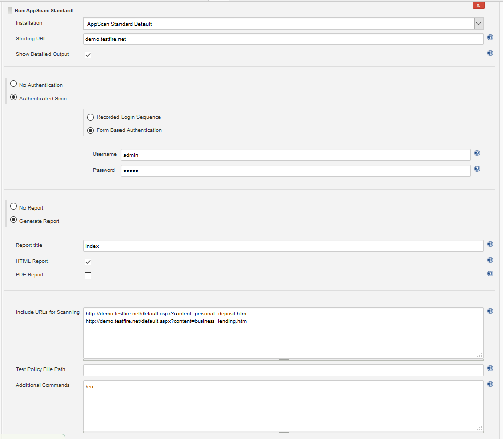

# appscanstandard-plugin
IBM's AppScan Standard Plugin for Jenkins

_________________________________________________________________________________________

IBM® Security AppScan® Standard helps organizations decrease the likelihood of web application attacks and costly data breaches by automating application security vulnerability testing. IBM Security AppScan Standard can be used to reduce risk by permitting you to test applications prior to deployment and for ongoing risk assessment in production environments.

IBM Security AppScan Standard supports:

    Broad coverage to scan and test for a wide range of application security vulnerabilities.
    Accurate scanning and advanced testing that delivers high levels of accuracy.
    Quick remediation with prioritized results and fix recommendations.
    Enhanced insight and compliance that helps manage compliance and provides awareness of key issues.
    
    http://www-03.ibm.com/software/products/en/appscan-standard
    
_________________________________________________________________________________________
    
# Running AppScan Standard on a Job
Please refer to the guide on [Jenkins Wiki](https://wiki.jenkins.io/display/JENKINS/IBM+Security+AppScan+Standard+Scanner+Plugin) for the setup instructions.

# Running AppScan Standard on a Pipeline
Please use the Pipeline Syntax to generate the pipeline script for AppScan and Publish HTML (if required).

(Sample Step: step: General Build Step > Build Step: Run AppScan Standard)
(Sample Step: publishHTML)
    
     stage ('Run AppScan Standard') {
             node ('slave-with-appscan') {
                 step([$class: 'AppScanStandardBuilder', additionalCommands: '', authScanPw: '',
                     authScanUser: '', includeURLS: '', installation: 'AppScan Standard Default',
                     pathRecordedLoginSequence: '', policyFile: '', reportName: '',
                     startingURL: 'demo.testfire.net'])
             }
     }
